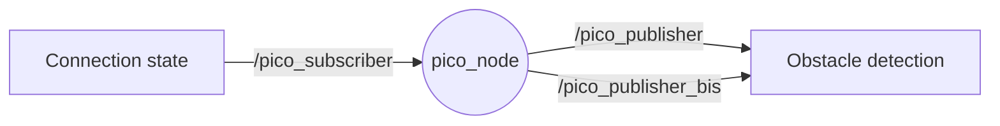
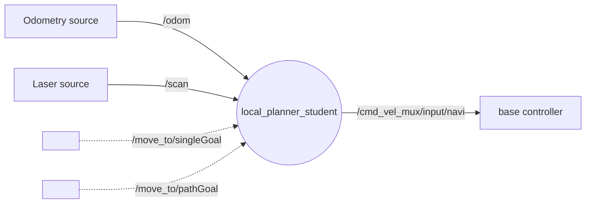
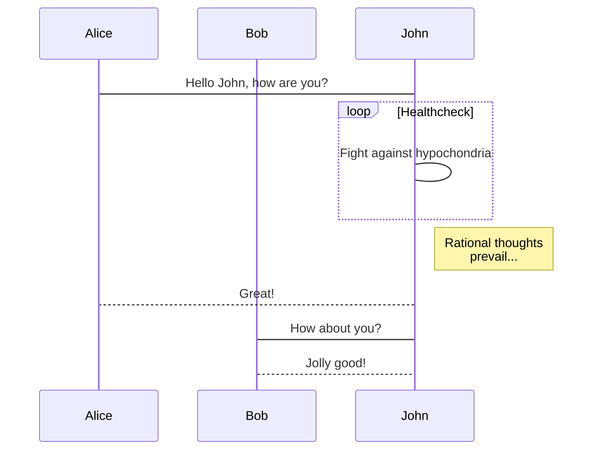

# "SPOK" Project

Authors:
- Théotime PERRICHET
- Arnaud SIBENALER

## Overview

This project, inspired by Boston Dynamics' Spot robot, aims to develop a quadruped robot capable of navigating inaccessible zones to assist in firefighting operations. 


### Hardware

Our robot is made up of 3D printed parts. Most of the 3D models can be found here: [Thingiverse Project](https://www.thingiverse.com/thing:3638679). Some parts have been recreated to fit to our electronics.

Hardware list:
- Raspberry Pi Zero 2W
- Servo Driver HAT (PCA9685)
- x12 Servo motors (MG996R)
- IMU (MPU6050)
- USB to Micro USB adapter
- USB webcam
- Raspberry Pi Pico
- x2 Ultrasonic sensors (HC-SR04)
- x4 Red LEDs with 220Ω resistors
- Jumper wires
- x2 Micro USB cables
- 7.5V mains power supply
- 3D printed parts (PLA)
- anti-slip material for the foot (foam, TPU, ...)
- x8 bearings
- screws, nuts, zip ties, glue

- Laptop connected to the same network


The total cost of the robot is around 200€.


# List of features:

1. [x] Control robot movements with a joystick
    1. [x] Simulation with Gazebo
    2. [x] Real robot
2. [x] Autonomous movements
    1. [x] Simulation with Gazebo
    2. [ ] Real robot
3. [x] Extra features
    1. [x] Connection state detection
    2. [x] Obstacle detection
    3. [x] Video feedback
    4. [ ] Person detection (too slow to be used)
    5. [x] Visual marker (LEDs)
4. [ ] Incomplete features
    1. [ ] Wake word engine (only works online)
    2. [ ] Text to speech


# Dependencies

- Robot:
  - Ubuntu 22.04
  - ROS2 Humble (ROS_DOMAIN_ID=0)
  - Python 3
  - Python libraries: smbus, smbus2, OpenCV, SpeechRecognition
  - ROS packages: usb_cam
  - Micro ROS Agent
- Computer:
  - Ubuntu 22.04
  - ROS2 Humble (ROS_DOMAIN_ID=0)
  - Python 3
  - Python librairies: OpenCV
  - ROS packages: Champ, CvBridge, Nav2, Joy


# Launch

- Robot:
  - Launch file
  ```sh
  ros2 launch spok_rob spok.launch.py
  ```
  - Micro ROS Agent
  ```sh
  docker run -it --rm -v /dev:/dev --privileged --net=host microros/micro-ros-agent:humble serial --dev /dev/ttyACM0 -b 115200
  ```

- Computer:
  - Manual mode
  ```sh
  ros2 launch quadruped_robot spot_bringup.launch.py
  ```
  OR
  - Autonomous mode
  ```sh
  cd src/S7_G7_Perrichet_Sibenaler/software/quadruped_robot/params/
  ros2 launch quadruped_robot spot_bringup_nav.launch.py headless:=False params_file:="nav2_params_empty.yaml" map:="<absolut path>/<maps>.yaml" 
  ```


# Nodes


## Micro ROS node → pico_node


We created a Micro ROS node, running in a Raspberry Pi Pico, to interface a microcontroller to the ROS environment.
The microcontroller is conected to 2 HC-SR04 ultrasonic sensors, and 4 LEDs, through its GPIO pins.






# Description de l'algo



# Vidéos de présentation

[Lien vers la vidéo pitch youtube](url)

[Lien vers la vidéo tutoriel youtube](url)

# Liste des dépendances et pré-requis

- a
- b

# Procédure de mise en route

- a
- b
- n


## PC nodes


## Features

- **Quadrupedal Locomotion**: Robust and stable walking mechanisms for rough terrain.
- **Real-Time Video Display**: A camera system to stream real-time video to remote operators.
- **Autonomous and Teleoperated Modes**: Switch between autonomous operation and manual control via a remote interface.

## Objectives

1. Develop a quadrupedal robot platform using 3D-printed parts and accessible components.
2. Leverage ROS2 for modular and efficient robotics software development.
3. Implement a robust locomotion algorithm for navigation.
4. Create a user-friendly interface for teleoperation and data monitoring.

## Hardware Requirements


- **Processor**: Raspberry Pi 4 or NVIDIA Jetson Nano for onboard processing.
- **Motors**: High-torque servo motors for leg movement.
- **Sensors**:
  - Thermal camera for heat detection.
  - Lidar for environmental mapping.
  - Gas sensor for hazardous gas detection.
  - IMU for stability and orientation.
- **Camera**: For real-time video streaming to remote operators.
- **Power Supply**: Lithium polymer (LiPo) battery pack.
- **Body**: 3D-printed frame using heat-resistant materials.

## Software Requirements

- **ROS2 (Robot Operating System 2)**
- **Python** for custom control algorithms.
- **Gazebo** for simulation.
- **Rviz** for visualization.
- **OpenCV** for computer vision tasks.
- **SLAM Toolbox** for mapping and navigation.

## Installation

...

## Usage

- **Simulation**:

- **Teleoperation**:

- **Real-Time Video Stream**:
  Access the live video feed from the robot’s camera through the provided ROS2 node or remote interface.

## Future Enhancements

...


