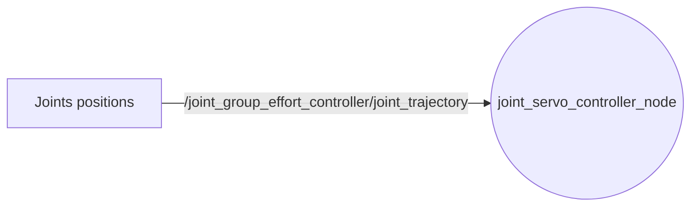
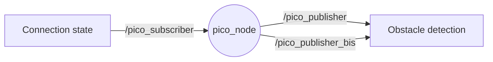
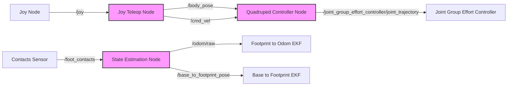
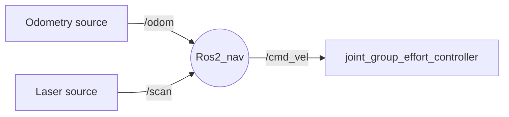

# "SPOK" Project

Authors:
- Théotime PERRICHET
- Arnaud SIBENALER

## Overview

This project, inspired by Boston Dynamics' Spot robot, aims to develop a quadruped robot capable of navigating inaccessible zones to assist in firefighting operations. 


### Hardware

Our robot is made up of 3D printed parts. Most of the 3D models can be found here: [Thingiverse Project](https://www.thingiverse.com/thing:3638679). Some parts have been recreated to fit to our electronics.

Hardware list:
- Raspberry Pi Zero 2W
- Servo Driver HAT (PCA9685)
- x12 Servo motors (MG996R)
- IMU (MPU6050)
- USB to Micro USB adapter
- USB webcam
- Raspberry Pi Pico
- x2 Ultrasonic sensors (HC-SR04)
- x4 Red LEDs with 220Ω resistors
- Jumper wires
- x2 Micro USB cables
- 7.5V mains power supply
- 3D printed parts (PLA)
- anti-slip material for the foot (foam, TPU, ...)
- x8 bearings
- screws, nuts, zip ties, glue

- Laptop connected to the same network


The total cost of the robot is around 200€.


# List of features:

1. [x] Control robot movements with a joystick
    1. [x] Simulation with Gazebo
    2. [x] Real robot
2. [x] Autonomous movements
    1. [x] Simulation with Gazebo
    2. [ ] Real robot
3. [x] Extra features
    1. [x] Connection state detection
    2. [x] Obstacle detection
    3. [x] Video feedback
    4. [ ] Person detection (too slow to be used)
    5. [x] Visual marker (LEDs)
4. [ ] Incomplete features
    1. [ ] Wake word engine (only works online)
    2. [ ] Text to speech


# Dependencies

- Robot:
  - Ubuntu 22.04
  - ROS2 Humble (ROS_DOMAIN_ID=0)
  - Python 3
  - Python libraries: smbus, smbus2, OpenCV, SpeechRecognition
  - ROS packages: usb_cam
  - Micro ROS Agent
  - Docker
- Computer:
  - Ubuntu 22.04
  - ROS2 Humble (ROS_DOMAIN_ID=0)
  - Python 3
  - Python librairies: OpenCV
  - ROS packages: Champ, CvBridge, Nav2, Joy


# Launch

- Robot:
  - Launch file
  ```sh
  ros2 launch spok_rob spok.launch.py
  ```
  - Micro ROS Agent
  ```sh
  docker run -it --rm -v /dev:/dev --privileged --net=host microros/micro-ros-agent:humble serial --dev /dev/ttyACM0 -b 115200
  ```

- Computer:
  - Manual mode
  ```sh
  ros2 launch quadruped_robot spot_bringup.launch.py
  ```
  OR
  - Autonomous mode
  ```sh
  cd src/S7_G7_Perrichet_Sibenaler/software/quadruped_robot/params/
  ros2 launch quadruped_robot spot_bringup_nav.launch.py headless:=False params_file:="nav2_params_empty.yaml" map:="<absolut path>/<maps>.yaml" 
  ```


# Nodes


## joint_servo_controller_node


This node acts as an interface between the position of every joint and the PWM sent to the servo motors.



Whenever a _JointTrajectory_ message is received from the _/joint_group_effort_controller/joint_trajectory_ topic, the angles are translated into duty cycles, and sent to the Servo Driver HAT which generates a PWM signal for every motor.
This node connects to the Servo Driver HAT through I2C, with the smbus Python librairy.


## mpu6050_node


This node is used to read acceleration values from the MPU6050 IMU, through the same I2C bus as the servo driver.

```mermaid
graph LR
    T1[IMU data] -. . .-> Node((mpu6050_node))

    Node -- /imu/data -->D[Odometry]
```


## Micro ROS node → pico_node


We created a Micro ROS node, running in a Raspberry Pi Pico, to interface a microcontroller to the ROS environment.
The microcontroller is conected to 2 HC-SR04 ultrasonic sensors, and 4 LEDs, through its GPIO pins.



The _/pico_subscriber_ subscriber changes the _state_ variable whenever a message is received. This variable changes the blinking pattern of the LEDs.

A timer is used to measure every 0.1s the distance with both ultrasonic sensors, and sends the measured values on the _/pico_publisher_ and _/pico_publisher_bis_ publishers.

To run this node, the c++ file must be compiled with `make -j4`. The microcontroller has to be plugged into a computer in "BOOTSEL" mode (by pressing the button when plugging it). The _.uf2_ compiled file can now be uploaded into the microcontroller.

The Micro ROS Agent is the interface between Micro ROS and ROS, and must be running on the Raspberry Pi to enable serial communication.
```sh
  docker run -it --rm -v /dev:/dev --privileged --net=host microros/micro-ros-agent:humble serial --dev /dev/ttyACM0 -b 115200
```


## manual control



## autonom control



